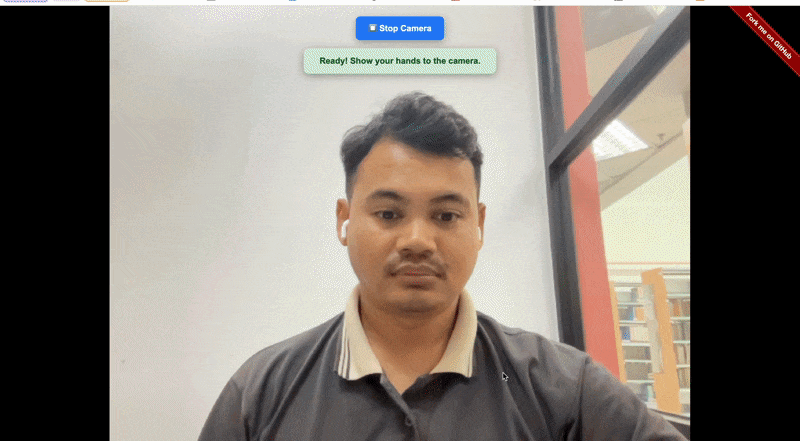

# Shadow Clone Technique🧑‍🤝‍🧑

## Demo

URL: [NARUTO.SS.MY](https://naruto.ss.my)

## Instructions

1. Open the link from a laptop, or computer with webcam and microphone

2. Click 'Start Camera' button when the website is loaded

3. Allow camera and microphone access when asked

4. Hold the handsign of Shadow Clone Jutsu on camera

5. A microphone logo will appear, say Shadow Clone Jutsu correctly

6. A lot of clones will appear on screen

## Tech Stacks
- Tensorflow Hand Pose Detection model
- [Fingerpose library](https://github.com/andypotato/fingerpose)
- Vue 2

## Known Bugs

- There's a slight delay between SpeechRecognition.start() and when it actually captures audio
- Requires very clear pronunciation of the keywords
- Sometimes your hand signs need to be in constant slight movement to keep the microphone active

## Todo

- Adding more Jutsu
- Supporting Japanese language

## License

Licensed under the [MIT license](http://opensource.org/licenses/MIT)
